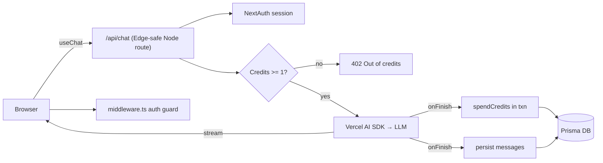

# 🌩️ Nimbus AI

> A production-shaped, full-stack **AI SaaS starter** — streaming LLM chat with authentication, conversation persistence, and a transactional **usage-based credit billing** ledger.

[](https://github.com/yourname/nimbus-ai/actions/workflows/ci.yml)


Nimbus is the part everyone rebuilds from scratch when shipping an AI product: auth, a database, streaming responses, and a way to *charge for tokens without losing money*. It's deliberately small enough to read in one sitting, but wired the way a real SaaS would be.

---

## ✨ Features

| | |
|---|---|
| 💬 **Streaming chat** | Token-by-token responses via the [Vercel AI SDK](https://sdk.vercel.ai) — works with OpenAI or any compatible endpoint (Ollama, Groq, Together). |
| 🔐 **Auth** | Credential auth with NextAuth v5 (JWT sessions) + Prisma adapter. Protected routes via middleware. |
| 🗄️ **Persistence** | Every conversation and message stored in Prisma (SQLite locally, Postgres in prod). |
| 🪙 **Credit billing** | Append-only `CreditLedger` with atomic, transactional spend/grant. 1 credit ≈ 1k tokens. Wallets can't go negative or drift from the ledger. |
| 🧪 **Tested** | Unit tests for the billing core (the part where bugs cost real money). |
| 🚢 **Deploy-ready** | Multi-stage `Dockerfile`, GitHub Actions CI, one-click Vercel config. |

---

## 🏗️ Architecture



**Billing flow:** requests are gated *before* calling the model (no wallet, no
spend), then reconciled in `onFinish` once the real token usage is known — all
inside a DB transaction so the running balance and the ledger never diverge.

```
src/
├── app/
│   ├── api/chat/route.ts      # streaming chat + billing reconciliation
│   ├── api/register/route.ts  # signup + free-credit grant
│   ├── (dashboard)/chat/      # protected chat UI
│   ├── login / register       # auth pages
│   └── page.tsx               # marketing landing
├── lib/
│   ├── credits.ts             # ⭐ transactional ledger (unit-tested)
│   ├── auth.ts                # NextAuth config + password hashing
│   ├── ai.ts                  # provider wrapper
│   └── db.ts                  # Prisma singleton
└── middleware.ts              # route protection
```

---

## 🚀 Quick start

```bash
git clone https://github.com/yourname/nimbus-ai && cd nimbus-ai
npm install
cp .env.example .env            # add your OPENAI_API_KEY + AUTH_SECRET
npm run db:push                 # create the SQLite schema
npm run db:seed                 # optional: demo@nimbus.ai / password123
npm run dev                     # http://localhost:3000
```

No OpenAI key? Point `OPENAI_BASE_URL` at a local Ollama server
(`http://localhost:11434/v1`) and set `OPENAI_MODEL=llama3`.

---

## 🧪 Tests & quality

```bash
npm test          # vitest — billing ledger unit tests
npm run typecheck # strict TypeScript, no emit
npm run build     # production build
```

CI runs all of the above on every push/PR (`.github/workflows/ci.yml`).

---

## 🛠️ Tech stack

**Next.js 15** (App Router, Server Actions) · **TypeScript** (strict) ·
**NextAuth v5** · **Prisma** · **Vercel AI SDK** · **Tailwind CSS** ·
**Vitest** · **Docker**

---

## 📈 What this demonstrates

- Designing a **money-safe** billing primitive (atomic, append-only, auditable).
- Real-time streaming UX with graceful credit/error handling.
- Clean separation: provider, persistence, auth, and billing are each isolated and swappable.
- End-to-end ownership: schema → API → UI → tests → CI → container.

## 📄 License

MIT — see [LICENSE](./LICENSE).
